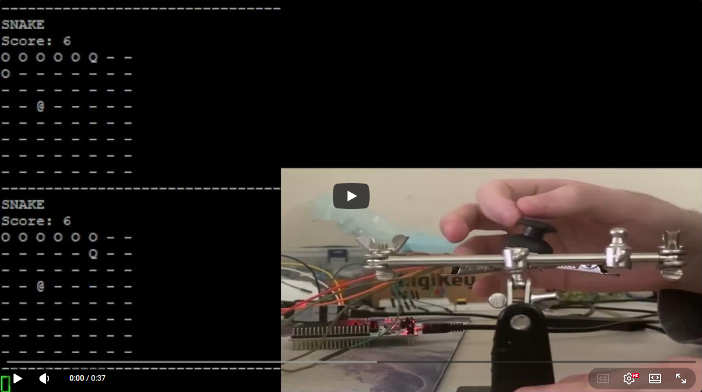

# STM32F4 UART Snake Game

## Demo

## Overview / Project Summary

This project implements the popular retro game Snake on a Nucleo STM32-F446RE microcontroller. One important aspect of this project was the avoidance of any HAL or LL drivers. The only software dependency of this project is the CMSIS-Core API. The game uses the UART communication protocol to repeatedly send the game data over to a PC, mimicing the behavior of a screen. When using a terminal emulator program like puTTY or TeraTerm, you can see and play the game. The game is played using a joystick, the user can move the joystick in the direction they want the snake to move.

## Motivation & Goals

My goal in making this project was to learn how to design and implement the UART communication protocol using only the CMSIS-Core API. The motivation behind doing this was to have low level control of the peripheral and gain a better understanding of the protocol. Eventually the project needed to expand beyond sending serial data over the peripheral, so I decided to make the classic game Snake.

## Constraints & Design Philosophy

- No HAL/LL usage
- CMSIS-Core only
- Low level control

## Hardware Setup

- Nucleo STM32-F446RE
- Joystick
- UART → PC “display”
